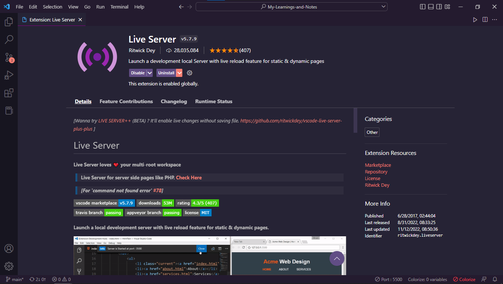

# <u>HTML</u> - Hyper Text Markup Language 👨‍💻

---

- The first phase in **Frontend Development** is considered to be HTML.
- HTML is referred to be the web language. i.e., HTML can be used to create web pages, and the internet is nothing more than a collection of data-filled web pages.
- HTML contains a wide range of ideas, including elements, tags, and content.
- A HTML element is made up of an opening tag, a closing tag, and any content that is present in it.

<br> 

  e.g.

  ```html
  <html>
    Content or Data
  </html>
  ```
  In this both `<html>` and `</html>` are opening and closing tag respectively.

---

## ⚙ Tools for development  :

### 1. VS Code

The fact that VS Code has an integrated `emmet abbreviation` feature makes it the finest editor for front-end development.

Although there are several code editors on the market that are just as good as VS Code, VS Code's support for extensions is by far the most beneficial, and once you become used to all of the shortcuts and environment, switching to another editor can be challenging.

<br>

#### Some Extensions which are totally change frontend experience with vs-code.

<br>

**1. Live - Server**

You can view or use your HTML file in your usual browser with the help of a live server. Even though it doesn't have a default assignment, the keyboard shortcut "Ctrl + 2" works for me with this extension.
<br>



<br>

**2. Colorize**

It gives the color to hex color code in CSS. Which will be helpful if identify any hex color.

<br>


<br>


**3. Color Themes**

I prefer different color themes for different project.

<br>


<br>

**4. Auto-Rename Tag**

This is most useful extension for HTML tags. It auto complete tag . and also It get easy to change tags with this extension.
<br>


<br>

### 2. Mozillla Firefox

All of the popular browsers on the market support HTML, so you can use any of them. However, Firefox works best with CSS. Compared to other browsers, it offers better developer options. Using CSS and Mozilla, I can mostly acquire the best font ideas.

<br>


<br>
---

## 🔴 Basic HTML program

```html
<!DOCTYPE html>
<html lang="en">
  <head>
    <meta charset="UTF-8" />
    <meta http-equiv="X-UA-Compatible" content="IE=edge" />
    <meta name="viewport" content="width=device-width, initial-scale=1.0" />
    <title>First HTML Website</title>
  </head>
  <body></body>
</html>
```

Above code is basic html **boiler plate** which easily appear if you type `!` in vs code (Visual Studio Code) and press enter.

Some of the concepts regarding above code :

1. `<!DOCTYPE html>` &rarr; Although this was helpful in the past (back when Netscape Navigator was available), it just defines the document as an HTML document.

2. `<html>` &rarr; This is tag which contains all web page contents.

3. `<head>` &rarr; This tag contain mainly meta data which is useful in SEO (Search Engine Optimization), also it contains `<title>` tag which shows the title of website in tab bar.

4. `<body>` &rarr; This tag all the visual content which will show in web page.

There so much to learn about `meta` tags and SEO but for basics and to run html page I think this info is more than enough.

---

## 🟠 Most useful HTML tags

### 1. Header Tag

This tag, which is used to provide headers, is exactly what its name implies. Additionally, using a header to simply make text bold is bad practice.

To Make SEO friendly website with header tag :

- `h1` tag is most important
- It states the content title
- Should not be same as `title` tag
- Every page should contain one `h1` tag.
- `h2` and `h3` should be below `h1` as

<br>

```html
<h1>
  <h2>
    <h3></h3>
  </h2>
</h1>
```

<br>

### 2. Paragraph Tag

Paragraph tag use for giving descriptions and paragraphs.


<br>

```html
<p>
  Lorem ipsum dolor sit amet consectetur adipisicing elit. Facere sit esse
  fugit, eligendi nisi quam adipisci ab dolor? Consequuntur consequatur harum
  dolorem itaque cumque! Unde!
</p>
```
<br>

The paragraphs on a website should be concise without being too brief in order to make it SEO friendly. The basic idea of the topic can be introduced first, followed by further explanation. Additionally, if the explanation is too lengthy, you should add subtopics.

### 3. Image Tag

It is use to place images in web pages. `alt` is attribute which is use for alternative text which is appear if image fails to show.And when hover mouse or pointer over image then text in `title` atribute appear.

<br>


```html

```
<br>

In order to create a website that is SEO-friendly, you must consider a few factors, such as adding a "alt" attribute to photos and providing descriptions; these factors are crucial for visitors who are blind and for search engines to provide relevant results. SEO considerations also include the "title" attribute. However, it is pointless to include a "alt" and "title" attribute if your image is only being used for design or decoration of a website. 

### 4. HTML Lists

List is just group of contents related to something.

<br>

There are two types in HTML Lists :
I. Ordered List
II. Unordered List

Syntax of both lists respectively :

```html
<!-- I. Ordered List -->

<ol>
  <li>First</li>
  <li>Second</li>
  <li>Third</li>
</ol>

<hr />

<!-- II Unordered List  -->

<ul>
  <li>Item 1</li>
  <li>Item 2</li>
  <li>Item 3</li>
</ul>
```

### 5. Link Tag

You can link with the help of `<a>` tag.

```html
<a href="https://www.google.com">GoTo Google</a>
```

---

## 🟡 HTML Tags for formatting

1. Bold &rarr;

```html 
<b>This is text in bold.</b>
```
    
    
2. Emphasize &rarr;

```html 
<em>Text in Emphasize</em>
```

3. Itallic &rarr;

```html 
<i>Text in itallic</i>
```


4. Mark - Make the text highlighted.  &rarr;
    
```html 
<mark>This is mark</mark>
```
    
5. Srikethrough or del  &rarr;
    
```html 
<del>This is text for strikethrough</del>
```

6. Superscript  &rarr;

```html 
a<sup>2</sup> + b <sup>2</sup> = c<sup>2</sup>
```

7. Subscript &rarr;

```html 
H <sub>2</sub> + O = H <sub>2</sub>O
```
***

## 🟢 HTML Table

Table is a tag which is use arrange data in tables in html.
There are two componenets of table that are **Head** and **Body**.
**Head** is header in which all titles get placed and **Body** is remaining part of the table.

**Syntax**:

```html
<table>

  <thead>

    <tr>

      <th>Head 1</th>
      <th>Head 2</th>
      <th>Head 3</th>

    </tr>

  </thead>

  <tbody>
    
    <tr>

      <td>Data 1</td>
      <td>Data 2</td>
      <td>Data 3</td>
      

    </tr>

  </tbody>

  <tfoot>
    <tr>
      <td>Footer 1</td>
      <td>Footer 2</td>
      <td>Footer 3</td>
    </tr>
  </tfoot>


</table>
```

So to add another row , you just have to add another `<tr>` (Table Row) and `<td>` (Table Data) tags.
`<tfoot>` is footer tag for table.

***

## 🔵 HTML Form

This contains `<form>` tag and `<input>` tag all the form tags are children of parent tag `<form>`

<br>

### input tag

This is a most important tag for forms. It contains some types they are as follows:

1. text : `<input type="text" name="MyName" />` gives text space to write some text . It can be use to write name , some info in words etc.
<br>
2. date : `<input type="date" name="MyDate" id="" />` gives option to add desire date. You can add any date with given arrangement.
<br>
3. number : `<input type="number" name="MyNumber" id="" />` gives option to add desire number . You can add any number with given arrangement.
<br>
4. Checkbox : `<input type="checkbox" name="MyCheckBox" id="" />`
<br>
5. Radio Button : `<input type="radio" name="MyRadioButton" id="" />` if you want to two option in radio button and if you have to give either one or two then name must be same in it.
<br>
6. textarea :  It is same as text but you can give number of columns and rows to expand area. 


```html
<textarea
  name=""
  id=""
  cols="20"
  rows="5">
</textarea>
```

<br>

7. select : If you have to give option other than given in radio button. 

```html
<select name="Car" id="Car">
    <option value="ind">Indica</option>
    <option value="Maruti" selected>Maruti</option>
</select>
```

8. Submit and Reset button : 

```html
<input type="reset" value="Reset Now" /><!--Reset all the form>-->
<input type="submit" value="Submit Now" /><!-- Submit the the form>
```

There is not much to explain but if just checkout the following project you will get whole idea of `HTML-Forms`

<br>

***


## 🟣 Projects
***

### e-slam Book Project

"e-slam Book" is the name of the project I built using solely HTML forms.
It's a relatively straightforward concept—just add some form components and ask about your friend's details. In spite of the fact that I used simply HTML for this project, all of the **HTML-Form** tags can be revised.

#### Preview Image :


**GitHub Link** : https://t.co/gCl4HeJklY

***

### Portfolio Website

I came up with this brilliant idea to revise all the HTML tags. "Portfolio website with only HTML" is the concept, which includes all major and minor tags. Additionally, it takes significantly less time and revise all the HTML. Even hosting is done via **Github Pages**.
<br>
#### Here's Preview Image &rarr;

<br>


**Hosted Link** : [https://rohitrajvaidya5.github.io/PorfolioWithHTML/](https://rohitrajvaidya5.github.io/PorfolioWithHTML/)


***

So that conclude this blog , I have included all essential as well as minor tags in this blog.
and arrived with a revision strategy. Because I believe that learning is simple , but that you still need to revise all you've learned and even should have better techniques for doing it quickly, I've used the word "revise" a lot in my blog. That's it, then.

***

In this blog, I exclusively discuss HTML, thus I left out some terms like "id" and "class," which are typically associated with CSS and Javascript.

***

## 📄 Blog Summary Points

1. [Tools For Developemt](#tools-for-development)
2. [Basic HTML Program](#basic-html-program)
3. [Most Useful HTML Tags](#most-useful-html-tags)
4. [HTML Tags For Formatting](#html-tags-for-formatting)
5. [HTML Table](#html-table)
6. [HTML Form](#html-form)
7. [Projects](#projects)

***